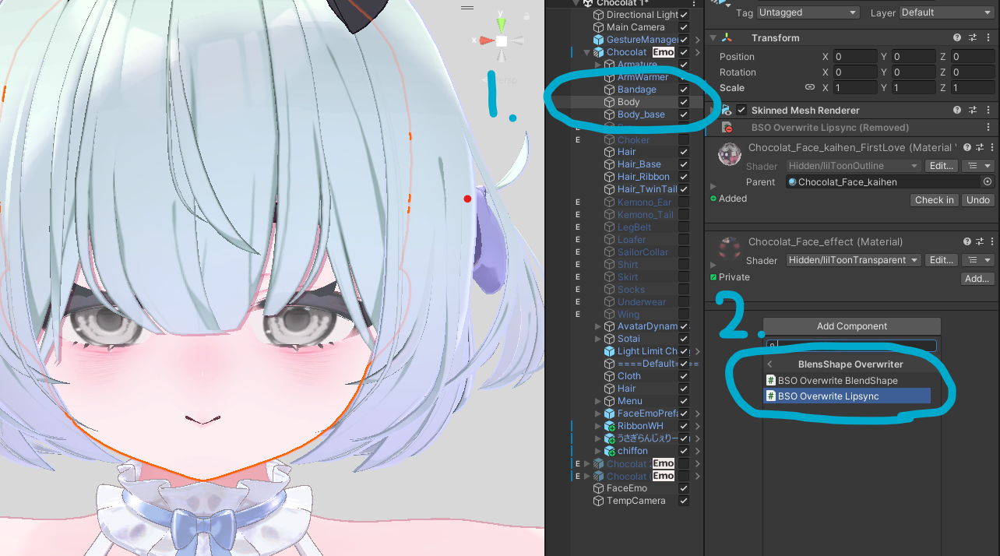
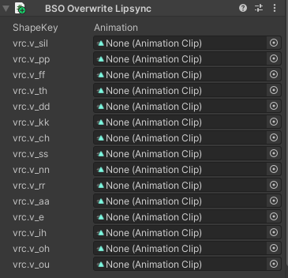
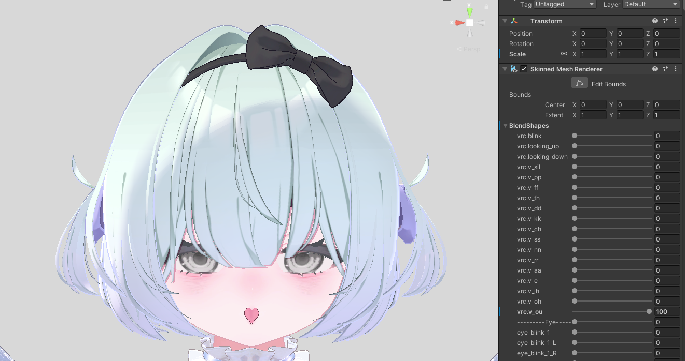
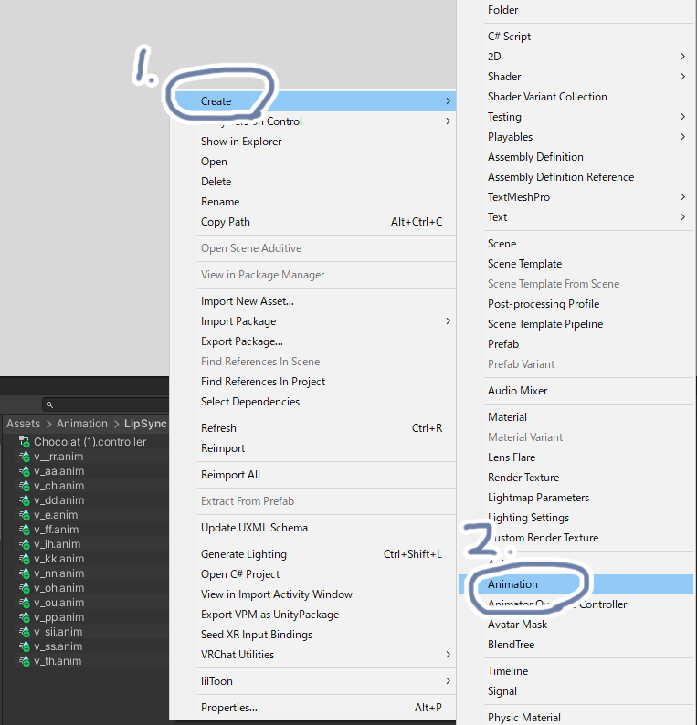
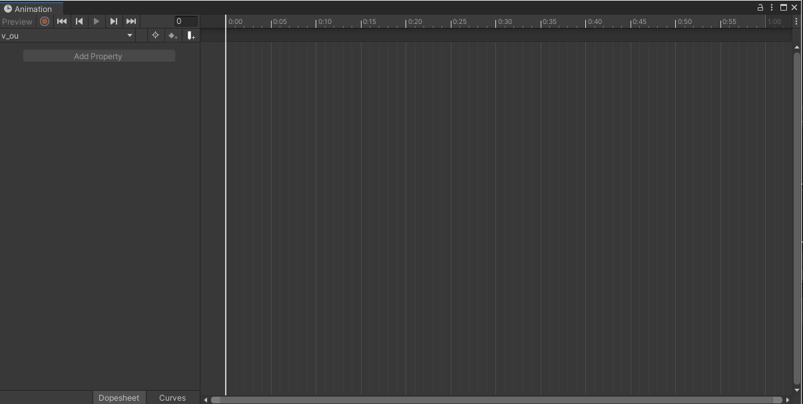
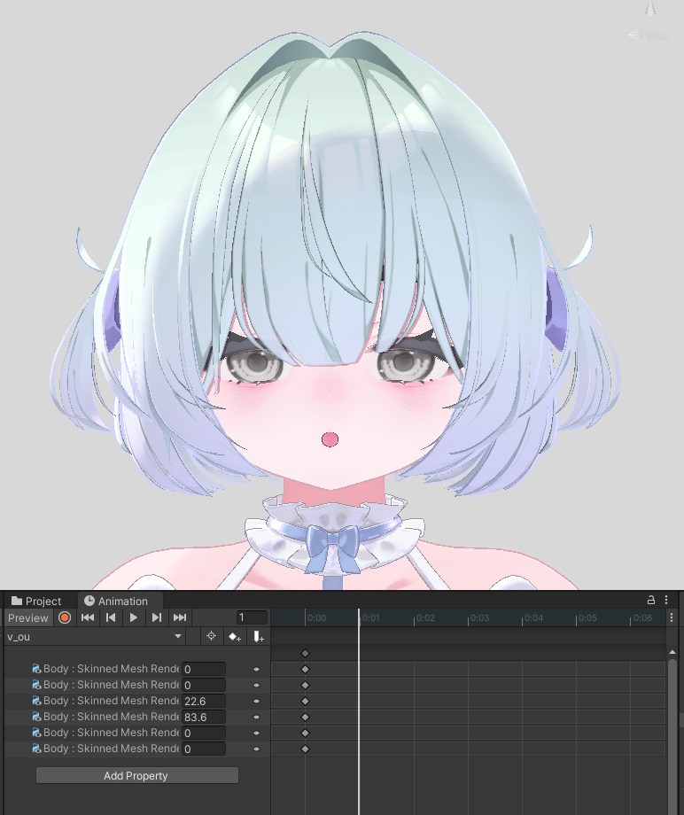
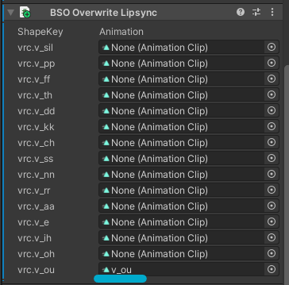
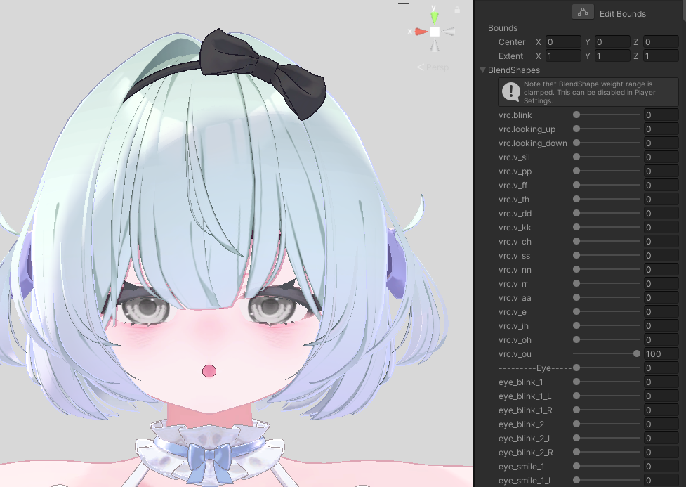

# リップシンクの破綻の修正

本ツールを用いた、"リップシンク用シェイプキー"の破綻の修正方法について説明します。  

## スクリプトのアタッチ

まずは下の写真のように、顔のメッシュ（Body）に、```Add Component```から```BSO Overwrite Lipsync```を検索してクリックしてみましょう。



すると、アバターに含まれるリップシンク用シェイプキーが自動で読み込まれ、次のようなスクリプトがInspector上に表示されます。  



このスクリプト```BSO Overwrite Lipsync```に上書き用のアニメーションを登録することにより、リップシンクの破綻を防ぐことができます。  

---

## 上書き用アニメーションの制作

続いて、上書き用アニメーションの制作方法について、特に破綻の大きくなりやすい```v_ou```シェイプキーを例にして説明します。



<!-- :::note ヒント
口を大きくあける
- v_oh
- v_ou  

は、特に破綻が目立ちやすいです
::: -->

まずは、```v_ou```の代替となる、理想の口の形のアニメーションを制作してください。  
こちらは、お好みの表情エディタを用いて制作してください。  

:::note 制作時の注意
- 元のシェイプキー```vrc.v_ou```を、アニメーションに含める必要はありません（任意です）
- 制作したアニメーションには、```v_ou```などのわかりやすい名前をつけることを推奨します
- 複数フレームのアニメーションの場合、0フレームの数値のみが参照されます
:::

アニメーション制作方法がわからない場合は、下記の```アニメーションの作り方```を参考にしてください。

<details>
<summary>アニメーションの作り方</summary>

ここでは、Unityの基本機能によるアニメーション制作を行います。  
特別なことは行いませんので、アニメーション制作方法をご存じの方は、ご自身の使いやすいツールを利用しての制作をおすすめします。

### 空のアニメーションファイルの生成

Project上で右クリックを押し、下の画像のように
1. Create
2. Animation  

と選択し、アニメーションファイルを生成しましょう。 

:::note
```v_ou```などのわかりやすい名前をつけておくことをおすすめします
:::



### アニメーションの制作
まずは、アバターをCtrl + Cで```コピー```したうえで、先ほど作ったアニメーションを```コピー先のアバター```にD&Dで割り当ててください。  

割り当てたら、先ほど作ったアニメーションをダブルクリックしてください。  
すると、次の画像のようなAnimationウィンドウが表示されます。



ここで、先ほど作った```コピー先のアバター```をクリックしてから、Animationウィンドウ左上の🔴を押してください。  

すると、```シェイプキーの数値を変更すると、それがアニメーションとして記録される```状態になります。  
この状態で、v_ouの代わりとなる表情を、自由に作ってみましょう。  
:::note
アニメーションの記録が終わったら、忘れずに🔴をもう一度押しましょう  
でないと、想定していない挙動まで、アニメーションに登録される可能性があります
:::

</details>

以上により、このような```v_ou```の上書きアニメーションが出来たとします。



---

## アニメーションのシェイプキーへの焼きこみ

最後に、制作したアニメーションをシェイプキーに焼きこみます。  

最初にアタッチしたスクリプト```BSO Overwrite Lipsync```に、制作したアニメーションをD&Dしてください。



これで完了です！  
実際に再生▶️して確認してみましょう  


無事に、想定した形になっていれば成功です

:::note 制作アニメーションと再生時▶で見た目が違う！！
以下の原因が考えられます。
- シーン上の表情と、再生時▶のデフォルトの表情が異なる（本アドオンは、シーン上の表情を元に計算しています）
- 別のアニメーションをD&Dしている
- アニメーションをD&Dしていない

このどれにも該当しない場合はバグの可能性が高いので、
- GitHub
- [作者のTwitter DM](https://x.com/kusumi_bell)

などで報告してくださるとありがたいです。
:::
